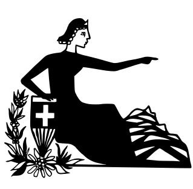

Chaeschchueli  
Chaeschchueli  
  
**Dough:**  
**Dough:**  
160 g flour  
1 tsp salt  
60 g butter, cold  
100 ml water  
**Filling:**  
120 g cheese, grated  
2 eggs  
125 ml milk  
125 ml cream  
nutmeg, salt and pepper  
  
**For the dough:**  
**For the dough:**  
Mix together flour and salt, then rub in cold butter with your hands or a pastry blender. Add the water, mixing gently until it all comes together. Gather the dough into a disc, wrap in plastic, and refrigerate for about 30 minutes.  
Roll out your dough, cut large rounds, and line a standard 12 cup muffin tin.   
Preheat oven to 200° C / 400° F / gas mark 6.  
**For the filling:**  
Whisk together the eggs, milk, cream, nutmeg, salt and pepper.   
Place your muffin tin on a baking sheet, then add the cheese to each cup. Pour the custard over top.  
Bake for about 25 minutes, or until the top is browned and the filling has set.  
  
  
* Any hard cheese—Gruyère, Appenzeller, Vacherin etc, or a mix of a few kinds, will work.  
* Any hard cheese—Gruyère, Appenzeller, Vacherin etc, or a mix of a few kinds, will work.  
