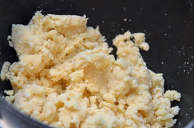
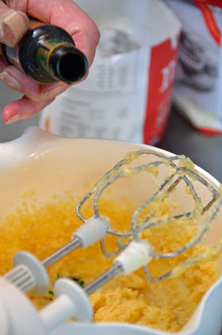
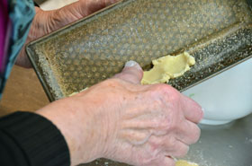
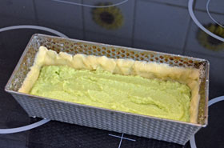

  
# Swedish Pistachio cake  
# Swedish Pistachio cake  
## 8 to 12 slices  
  
## Tip  
Make sure you bake the cake for long enough. The top needs to be firm and a skewer poked into the middle of the cake must come out clean. If in doubt, bake it for another 5 minutes.  
## Ingredients  
  
**Dough**  

| 50 g | (1¾ oz) | butter, cubed             |
| ---- | ------- | ------------------------- |
| 28 g | (2 oz)  | caster (superfine) sugar  |
| 80 g | (2¾ oz) | plain (all-purpose) flour |
  
**
Filling**  

| 150 g | (5¼ oz) | whole almonds, shelled   |
| ----- | ------- | ------------------------ |
| 100 g | (3½ oz) | butter                   |
| 3     |         | eggs                     |
| 160 g | (5½ oz) | caster (superfine) sugar |
|       |         | green food colouring     |
  
**
Finishing**  

|  |  | icing sugar (confectioner's sugar/powder sugar) |
| - | - | ----------------------------------------------- |
  
**Method**  
  
1. Bring a saucepan of water to the boil and remove from the heat. Put the raw (shelled) almonds in to the water for 1 minute. Drain them and run under cold water immediately, until cool enough to handle. Hold an almond between your thumb and fore-finger, squeeze to slide the skin off. Let them drain on paper towels whilst you make the dough.  
  
2. Mix the ingredients for the dough until evenly blended. You can do this in a food processor if you prefer. Cover and leave to rest in a fridge.  
3. Grind the almonds using a grinder or a food processor so that you have a coarse mixture (called almond meal).  
4. Mix butter, eggs and sugar for the filling. Stir in the ground almonds.  
  
5. Add some colouring and mix until evenly coloured. Add more if necessary.  
6. Pre-heat the oven to 200°C (400°F, Gas 6, Fan 170°C).  
  
7. Grease a 1 litre (4 cup) loaf tin (pan) and then dust with bread crumbs. Using your fingers, press the dough into the tin, covering the sides and the bottom of the tin (pan). Don’t worry if it looks a bit bumpy!  
  
8. Pour the filling in and then bake for 25-30 minutes, until a skewer comes out clean and the top is firm.  
9. Let the cake cool in the tin (pan) on a wire rack. After ten minutes loosen the cake with a knife, but leave it in the tin to cool completely. When it is cold carefully removed it from the tin.  
10. Dust the top with icing sugar (confectioner’s sugar) before slicing!  
