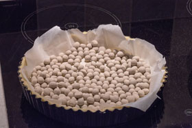
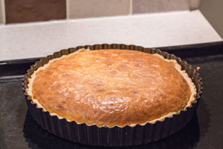
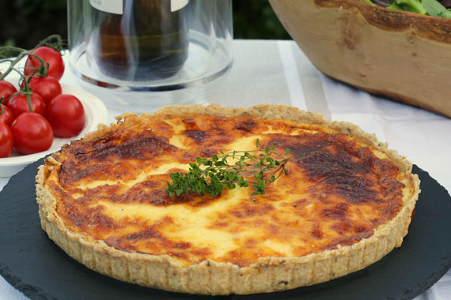
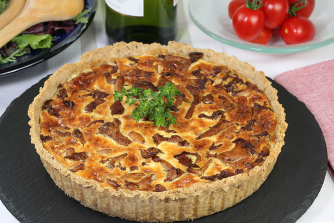
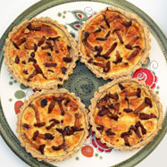
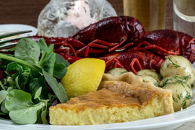

Västerbotten cheese tartan  

[https://www.swedishfood.com/swedish-food-recipes-main-courses/212-cheese-tart](https://www.swedishfood.com/swedish-food-recipes-main-courses/212-cheese-tart)  
## Ingredients  
**Pastry case**  

| 120 g  | (4½ oz) | plain (all-purpose) flour     |
| ------ | ------- | ----------------------------- |
|        |         | pinch of salt                 |
| 100 g  | (4 oz)  | butter, cut into small pieces |
| 2 tbsp |         | cold water                    |

**Filling**  

| 200 g  | (7 oz)    | Västerbottensost, grated             |
| ------ | --------- | ------------------------------------ |
| 3      |           | eggs                                 |
| 200 ml | (¾+ cup)* | whipping cream                       |
|        |           | salt and freshly ground black pepper |

 *¾ cup plus 1 tablespoon  
##  Method  
1. Add the flour and a pinch of salt to a food processor. Whiz briefly. Add the butter and process for 10-15 seconds until the mixture resembles fine breadcrumbs.  
2. Sprinkle on the water and process for 20-30 seconds until the pastry clings together and forms a ball. Remove the pastry from the machine and knead it lightly to form a flat disc. Wrap in cling film (food wrap) and refrigerate for 30 minutes, or up to 24 hours.  
  
3. Preheat the oven to 200°C (400°F, gas 6, fan 180°C). Roll out the pastry on a lightly floured surface and line a deep 22 cm (9”) flan tin (pan). Line the pastry with a sheet of greaseproof (waxed) paper and fill with baking beans. Bake blind for 10 minutes until the pastry has set.  
4. Carefully remove the baking beans and greaseproof paper then return to the oven for a further 5 minutes until the base is dry.  
5. Meanwhile, beat the eggs and cream together, add the cheese and season to taste, bearing in mind that the cheese is very salty. Remove the flan from the oven and pour in the cheese mix.  
  
6. Bake for about 30 minutes until the filling is set and the top is golden brown.  
7. Allow the pie to cool in the tin (pan) and serve lukewarm or cold.  
  
## A spiced rye pastry case with a lighter filling  
  
I really like this case which is easy to make, has a lovely flavour and keeps well.  

| 120 g  | (¾ cup)  | plain (all-purpose) flour    |
| ------ | -------- | ---------------------------- |
| 60 g   | (6 tbsp) | wholemeal (dark) rye flour   |
|        |          | pinch of salt                |
| 1 tsp  |          | caraway seeds                |
| 125 g  | (4½ oz)  | cold butter, cut into pieces |
| 2 tbsp |          | cold water                   |

The method for making the pastry case is essentially the same as above for the classic recipe.  
1. Add the flours and a pinch of salt to a food processor. Whiz briefly.  
2. Add the caraway seeds and butter pieces and process for 10-15 seconds until the mixture resembles fine breadcrumbs. Sprinkle on the water and process for 20-30 seconds until the pastry clings together and forms a ball.  
3. Roll out the dough on a lightly floured surface and use it to line a 22 cm (9") flan tine (pan). Chill for 30 minutes.  
4. Preheat the oven to 200°C (400°F, gas 6, fan 180°C).  
5. Line the pastry with a sheet of greaseproof (waxed) paper and fill with baking beans. Bake blind for 10 minutes until the pastry has set.  
6. Carefully remove the baking beans and greaseproof paper then return to the oven for a further 5 minutes until the base is dry.  
**A lighter filling**  
I prefer a lighter filling made by simply replacing the cream with milk. (Half-and-half, cream and milk, also works well.)  

| 3      |          | eggs                                 |
| ------ | -------- | ------------------------------------ |
| 200 ml | (¾+ cup) | milk                                 |
| 200 g  | (7 oz)   | Västerbottensost, grated             |
|        |          | salt and freshly ground black pepper |

The method is exactly the same as steps 5-7 for the classic recipe.  
  
## *Västerbottenpaj med kantareller*  
  
Without doubt, my favourite is *Västerbottenpaj med kantareller* (cheese flan with girolle mushrooms). It is a real Swedish classic being a popular addition to a buffet at a crayfish party, when fresh *kantareller* can be used, as well as to Christmas, Easter and Midsummer buffets, when frozen *kantareller* are used. A *västerbottenpaj med kantareller* really is Swedelicious!  
Note that eggs, milk and cream are mixed together and then poured into the part-baked pastry case. The cheese is then added and finally the *kantareller*. This improves the appearance of the tart, because the *kantareller* remain on the top, as shown above.  
  
I also like to make these as individual tarts for picnics and ***[kräftskivor](https://www.swedishfood.com/crayfish-parties)*** (crayfish parties). The pastry is sufficient for four 10 cm (4 inch) diameter tarts. However, often the small tart cases are only 2 cm (¾ inch) deep, so you may only need half as much filling.  

| 1      |          | pastry case                           |
| ------ | -------- | ------------------------------------- |
| 175 g  | (1 cup)  | girolle mushrooms, fresh or defrosted |
| 2 tbsp |          | butter                                |
| 2      |          | eggs                                  |
| 100 ml | (6 tbsp) | cream                                 |
| 100 ml | (7 tbsp) | milk                                  |
|        |          | salt and freshly ground black pepper  |
| 200 g  | (7 oz)   | Västerbottensost, grated              |

**Method**  
1. Chill the pastry case and preheat the oven to 200°C (400°F, gas 6, fan 180°C).  
2. If the girolles are fresh, brush or wipe them clean, but try to avoid washing them. If the girolles have been defrosted, drain them thoroughly and pat them dry.  
3. Melt the butter in a frying pan, add the girolles, fry briskly until nicely coloured and then set aside. (If they produce a lot of liquid, spoon it off and then fry until any liquid has evaporated.)  
4. Line the pastry with a sheet of greaseproof (waxed) paper and fill with baking beans. Bake blind for 10 minutes until the pastry has set. Carefully remove the baking beans and greaseproof paper then return to the oven for a further 5 minutes until the base is dry.  
5. Lightly whisk the eggs, cream, milk, salt and pepper together and then pour into the pastry case. Add the grated cheese on top and finally the fried girolles. Bake for 25-30 minutes until the top is nicely browned and the mixture has set.  
6. Serve lukewarm or cold.  
  
## Garnishing with *Kalix löjrom*  
***[Kalix löjrom](https://www.swedishfood.com/caviar)*** (vendace roe, also called 'Caviar of Kalix') makes an excellent garnish if you can buy some, although not many shops outside of Scandinavia stock it. You need between 50 and 100 grams (2-4 oz), depending on your budget, per tart.  
*Kalix löjrom* can be quite watery, so you need to drain it for a couple of hours, through coffee filter paper or a kitchen towel sat inside a sieve, so that it becomes dry enough to shape.  
When ready to serve, add a couple of tablespoons of crème fraîche to the top of a *västerbottensostpaj* and then, using two spoons, mould the roe into an egg shape and nestle it on top of the crème fraîche.  
  
## Crayfish parties  
  
*Västerbottensostpaj* is popular at *kräftskivor* (crayfish parties) because crayfish are expensive and not very filling! A good *paj* lowers the cost of the party and helps to soak up the alcohol! For tips on organising a crayfish party **[click here](https://www.swedishfood.com/crayfish-parties)**.  

